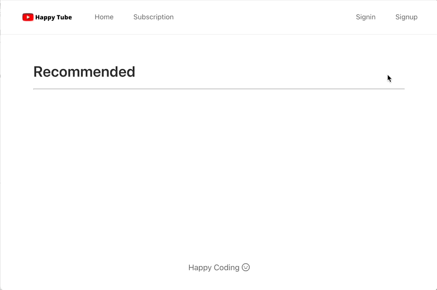
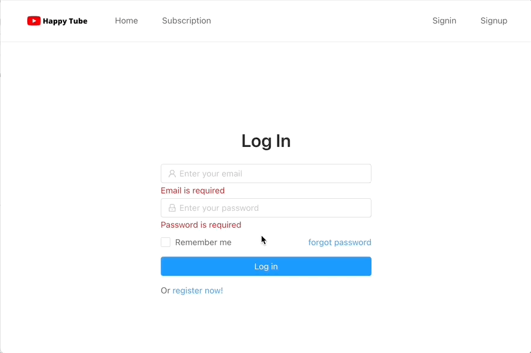

# 유튜브 클론코딩
John Ahn님의 [boilerplate-mern-stack](https://github.com/jaewonhimnae/boilerplate-mern-stack)을 기반으로 제작한 유튜브 클론코딩입니다.
실행을 위해선 다음과 같은 4가지 단계가 필요합니다.
1. dev.js를 'config' 파일 안에 생성
2. mongoDB를 dev.js파일에 연결
3. Server Dependencies를 위해 root directroy에서 "npm install" 하기
4. Front-end Dependencies를 위해 client directory에서 "npm install" 하기

## 사용한 스택

React
Node.js
Redux
MongoDB

## 기능 설명

1. 회원가입
   

  
  
2. 로그인
   

  
  
3. 비디오업로드
   

  
  
4. 구독
   

  
  
5. 댓글
   

  
  
6. 좋아요/싫어요 기능
   

  
